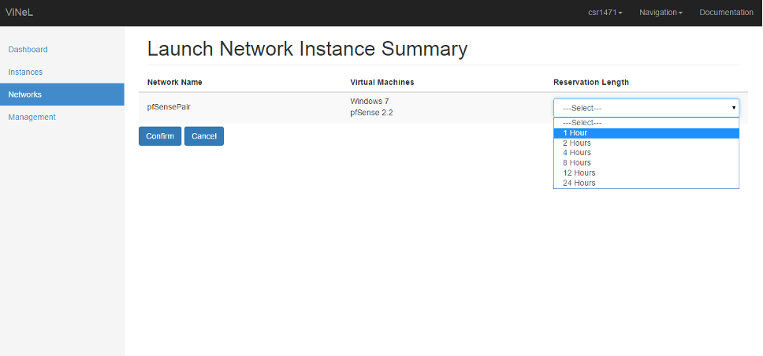

# ViNeL: A Virtual Networking Lab for the Cyber Defense Training

ViNeL significantly reduces testing environment setup times by establishing a virtual networking lab (ViNeL) that allows users to spin up an entire network of virtual machines to simulate business environments and compositions. The application also allows users to launch a single operating system for lab style experimentation. The application uses the remote desktop protocol (RDP) to make it platform independent. Built using Oracle VirtualBox on a LAMP stack (Linux, Apache, MySQL, and PHP), the virtual networking lab is completely open source and can be implemented on a variety of server hardware configurations.
